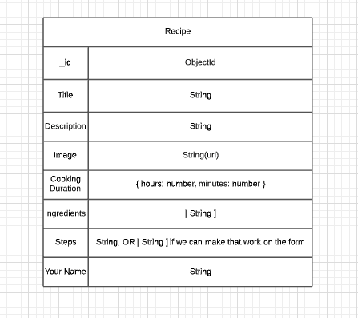

# CakeHub

## Date: 8/25/2021

### By: Jae, Sam P., Jin Im

---

**_Description_**

Our app, CakeHub, is a dessert recipe site in which users can view various recipes as well as add their own.

**_Technologies Used_**

- Atlas
- Heroku
- React
- MongoDB
- Mongoose
- Express

**_Getting Started_**

**_Screenshots_**

##### Component Heirarchy Diagram

##### Entity Relationship Diagram

