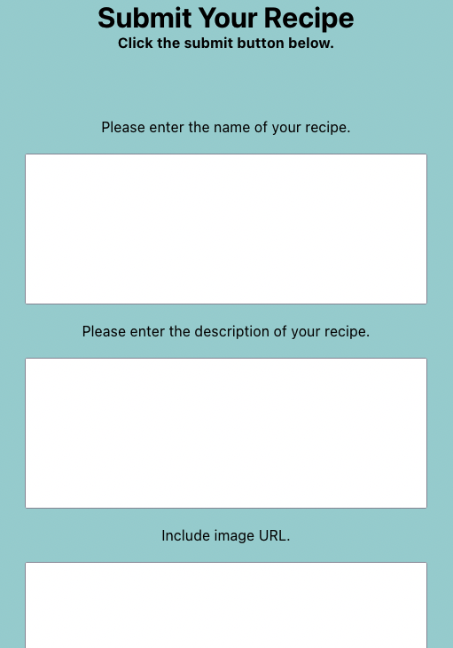
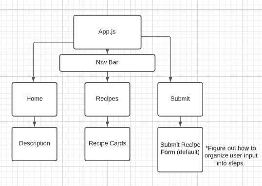

# CakeHub

## Date: 8/25/2021

### By: Jae, Sam P., Jin Im

---

**_Description_**

Our app, CakeHub, is a dessert recipe site in which users can view various recipes as well as add their own.

**_Technologies Used_**

- Atlas
- Heroku
- React
- MongoDB
- Mongoose
- Express
- Node

**_Getting Started_**

You can find the site at [CakeHub](https://polar-beyond-25356.herokuapp.com/) and browse to your heart's content.

**_Screenshots_**

#### Browsing Recipes

#### Submitting a new recipe

**_Process Screenshots_**

##### Component Heirarchy Diagram

##### Entity Relationship Diagram

**_Future Updates_**

- [ ] Search for individual recipes
- [ ] Filter by recipe type
- [ ] Filter by cooking duration
- [ ] Always: add more recipes!
- [ ] User profiles

**_Credits_**

[Google Font](https://fonts.google.com/)
